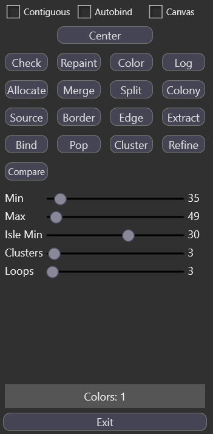

# Mup

This is a tool that contains various functions that manipulate or analyze a map. It was written in 2020.

It is the culmination of many years of tweaking various maps for various worldbuilding projects, dating back to at least 2016.
I wrote several python scripts and kept copying them into new projects, slightly modifying them and expanding on them as I went.
There were various iterations of master scripts that contained functions which were operated through console arguments.
Eventually, in 2020, I decided to consolidate everything into a dotnet project and add additional functions.

In my worldbuilding projects, I would have one or more continents which I would subdivide into regions (which were usually called cells).
Each of these regions could then be subdivided further. I would use scripts to split or combine regions, draw borders, find unique colors, and more.

---

This tool has a graphical UI as it is built with WPF.
The UI elements themselves are straightforward but the buttons that control functions are not self-explanatory.

The checkboxes at the top alter some of the functions below. The _contiguous_ checkbox defines whether cells are made of contiguous same-color pixels (which I refer to as blobs) or noncontiguous blobs. The _autobind_ checkbox is used with the advanced _Bind_ and _Pop_  functions.

Each of the buttons in the four-by-four grid represents a function.

The sliders are used by some of the functions in various ways. The _min_ and _max_ sliders, for example, define the minimum and maximum size of a cell when using _Merge_ or _Split_ to combine or separate cells that are either too big or too small.

The _Colors_ label at the bottom displays the total number of unique colors in the image. Pure black and pure white (#000 and #FFF) are ignored.